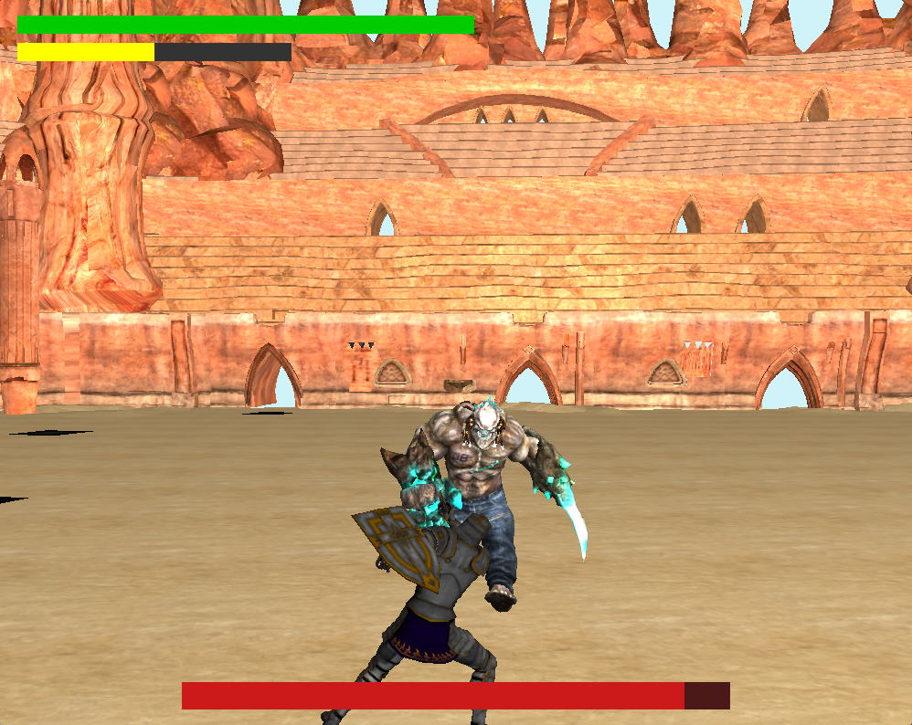

# Arena Souls

An immersive 3D combat game built with OpenGL featuring intense sword fighting mechanics inspired by souls-like games.

## 🎮 Game Description

Arena Souls is a third-person combat game where players face off against challenging enemies in a gladiatorial arena. The game features:

- **Dynamic Combat System**: Multiple attack combos, blocking, dodging, and parrying mechanics
- **Character Animation**: Smooth animation state machine with idle, walk, run, attack, and defensive states
- **Boss Battles**: Challenging AI opponents with unique attack patterns
- **Training Mode**: Practice your skills against training dummies
- **3D Audio**: Immersive sound effects and background music
- **Visual Effects**: Modern OpenGL rendering with lighting and shadows

## 🎥 Demo Video


https://github.com/user-attachments/assets/155943fd-8233-45a7-9b6c-2d4c0becc766


## 📸 Screenshots


<div style="display: inline-block;">


</div>
<div style="display: inline-block;">


</div>

## 🎯 Itch.io Project

Play the game online: https://zz1rg.itch.io/arenasouls

## 🎮 Gameplay Features

### Combat Mechanics

- **Attack Combos**: Chain multiple attacks for devastating combinations
- **Defensive Options**: Block incoming attacks or time perfect dodges
- **Parrying System**: Counter-attack opportunities for skilled players
- **Stamina Management**: Strategic resource management during combat

### Controls

- **WASD**: Movement
- **Mouse**: Camera control
- **Left Click**: Attack
- **Right Click**: Block/Parry
- **Space**: Dodge/Roll
- **Shift**: Run

## 🛠️ Technical Features

- **OpenGL 4.0+**: Modern graphics pipeline
- **Assimp**: 3D model loading and animation
- **GLFW**: Window management and input handling
- **GLM**: Mathematical operations
- **irrKlang**: 3D audio engine
- **FreeType**: Text rendering
- **Custom Animation System**: State-based character animation
- **Physics**: Collision detection and response

## 📁 Project Structure

```
ArenaSouls/
├── Libraries/           # External libraries and headers
├── resources/          # Game assets (not included in repo)
│   ├── objects/       # 3D models
│   └── sounds/        # Audio files
├── src/               # Source code
├── *.cpp              # Core game files
├── *.vs/*.fs          # Shader files
└── CMakeLists.txt     # Build configuration
```

## 🔧 Development Setup

### Visual Studio 2022 Setup

- Open **ArenaSouls.sln** file in VS 2022
- Right click the project name -> **Properties** -> **Configuration Properties/VC++ Directories**
- Make sure that **"Include Directories"** and **"Library Directories"** are set to our **include** and **lib** in **Libraries** path

  

- Go to Configuration **Properties/Linker/General** and make sure that **Additional Library Directory** is set like the picture below

  

- Go to Configuration **Properties/Linker/Input** and make sure that **Additional Dependencies** is set like the list below

  - glfw3.lib
  - opengl32.lib
  - assimp.lib
  - freetype.lib
  - glew32s.lib
  - irrKlang.lib
  - SOIL.lib

  

- Finish!

### Building with CMake (Alternative)

1. Install dependencies (OpenGL, GLFW, etc.)
2. Create build directory: `mkdir build && cd build`
3. Generate build files: `cmake ..`
4. Build: `cmake --build . --config Debug`

## 🏗️ Architecture

### Core Components

- **Entity System**: Base class for all game objects with position, rotation, and hitbox
- **Animation Controller**: State machine managing character animations
- **Camera System**: Third-person camera with smooth following
- **Audio Engine**: 3D positional audio with sound effects
- **UI System**: OpenGL-based user interface rendering
- **Debug Renderer**: Visual debugging tools for hitboxes and collision

### Game States

1. **Menu**: Main menu with game start options
2. **Game Active**: Core gameplay loop
3. **Win/Lose**: End game states with appropriate feedback

## 🎨 Assets Attribution

- **Arena Model**: "Geonosis Arena" (https://skfb.ly/6Vq8K) by StrangeUsernames1 is licensed under Creative Commons Attribution (http://creativecommons.org/licenses/by/4.0/)
<!-- - **Character Models**: [Add your character model attributions here]
- **Sound Effects**: [Add your sound effect attributions here]
- **Music**: [Add your music attributions here] -->

## 🚀 Installation & Running

### Prerequisites

- Windows 10/11
- Visual Studio 2022 (or compatible C++ compiler)
- OpenGL 4.0+ compatible graphics card

### Quick Start

1. Clone the repository:

   ```bash
   git clone [your-repo-url]
   cd ArenaSouls
   ```

2. Open `ArenaSouls.sln` in Visual Studio 2022

3. Follow the Visual Studio 2022 setup instructions above

4. Build and run the project (F5)

5. **Important**: Download game assets separately and place in `resources/` directory

## 🎯 Development Roadmap

### Completed Features

- ✅ Basic combat system
- ✅ Character animation
- ✅ Boss AI
- ✅ Audio integration
- ✅ Menu system

### Future Enhancements

- 🔄 Multiple enemy types
- 🔄 Level progression
- 🔄 Inventory system
- 🔄 Special abilities
